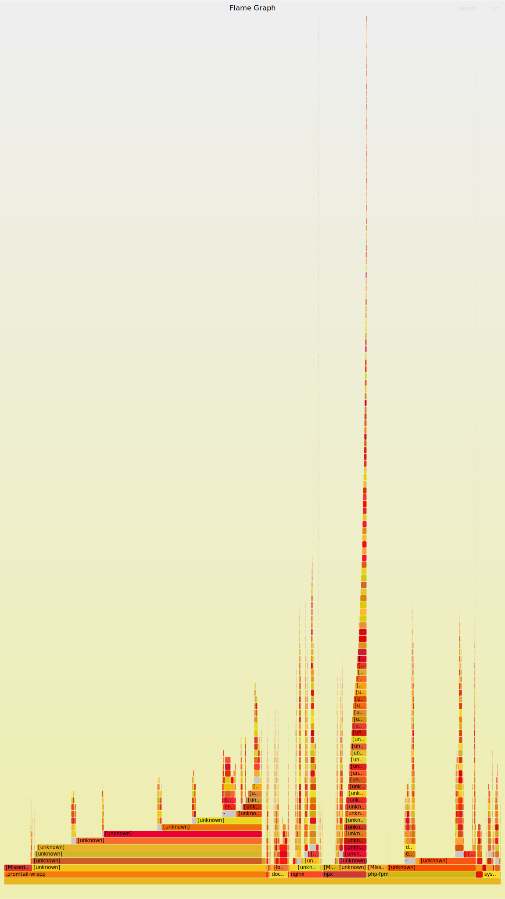

# Set up
We are using 3 images: nginx:alpine as a Web Server, mariadb as a Database and wordpress:php7.3-fpm-alpine. For build, we are using docker-compose, so it is cleaner.

# Execution
In order to build containers you need to clone this repo and while in the 'task1' folder you can use 
```
docker-compose up -d 
```
and 3 containers should build. It is also important that on the level of 'docker-compose.yaml' file, there should be configuration file in nginx folder (if you cloned our repo, it should be there)


Now you need to got to http://131.159.102.8:8180/ and there will be clean wordpress waiting for initialize. Do it and in the section where you set up login and password, for both you could use 'teamd', so u don't need to modify script for REST api calls.

Next you should import dummy post from a lecture. And install plugin in wordpress 'WordPress REST API Authentication'. After installation activate it, in configuration chose 'Basic Authentication' and save configuration'.

Now, when all is running we can start running 'get' and 'post' request. For this you have shell script 'performance.sh'. For testing the home page, you can run it like this:
```
sh performance.sh get
```
While for testing the creation of the page, like this:
```
sh performance.sh post
```

Results will be generated in the /results folder. If you want to generate plots you have python script for this 'generate_plots.py'. Make sure that you generated both results for 'post' and 'get' and then simply run the python script. (we are using matplotlib for generating figures, so it would be better if you use 'scp' and run the python script on your computer, so you can see the plots)

For system profiling we used 'profile' tool and FlameGraph. We generated 2 flame graphs for CPU while doing 'get' benchmark and same for 'post'. When you start running shell script for ```# sh performance.sh get``` then in the same time you should start this tool: 
```
sudo profile -fg 300 > out-get.profile
```
It will measure CPU usage for 300s and then writes it to the 'out-get.profile' (if the benchmark ends sooner than you can just ctrl+c). Now if you want to generate the flame graph you need to clone the repo of FlameGraph:
```
git clone https://github.com/brendangregg/FlameGraph
```
and then you can use the previously generated file to generate flame graph in svg format, like this:
```
./FlameGraph/flamegraph.pl out-get.profile > get-flamegraph.svg
```
Open svg in any browser. Repeat these steps to generate one for the 'post' results.

# Plots

 


#### Flame graph for 'get'


#### Flame graph for 'post'


# Exploration task

Here we change two things: first we add caching plugin to wordpress, and then we play with the DB config. For testing, you should run everything as in a basic task. Here is what we changed:

1. Wordpress caching plugin: You need to add 'W3 Total Cache' plugin. Activate it and go through the setup choosing all the recommended options (click on a test button, and it will tell you what is recommended)

2. Database: in the /exploration folder you can find new docker-compose.yaml, that you need to switch (there is just a one change that links the config to mariandb). In /dbconfig folder there is a needed config, so if you clone the repo it should be at the place.


# Plots


#### Flame graph for 'get'


#### Flame graph for 'post'


# Results 

This report provides an exemplary setup for a WordPress blog deployed using a three container docker setup. The images used were chosen with the goal of optimizing the application for throughput while preserving a “standard” blog setup. We created a performance analysis testbench and further optimized the application in reads to caching for GET and DB-configurations for POST requests, resulting in an overall significant performance boost. Further work could include investigating other, less widely known, options for web servers and databases that could perform better for high-throughput scenarios and further tweaking configuration settings using longer tests.
