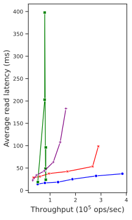
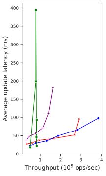

# How to run

Use ```sudo``` to run the evaluations!

Run the evaluations with:

```console
$ sudo python3 reproduce.py 
```

You might grab a coffee...since the script needs a couple of minutes to execute all tests.

The plots will be generated in the folder ```basic/results```, where all outputs from the benchmark tests are located in
the folders ```basic/benchmarks``` and ```explore/benchmarks```.

# Generated plots

 
